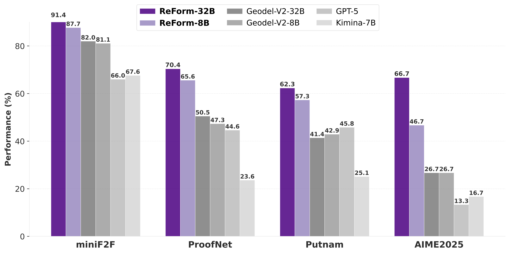
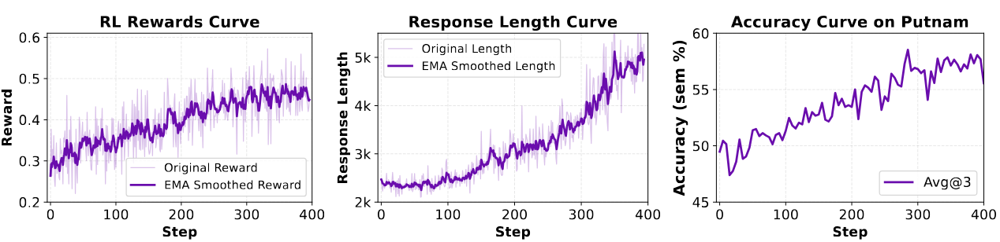

<div align="center">

# ReForm: Reflective Autoformalization with Prospective Bounded Sequence Optimization

<a href='https://arxiv.org/pdf/2510.24592'></a>
<a href='https://huggingface.co/collections/GuoxinChen/reform'></a>
<a href='https://huggingface.co/datasets/GuoxinChen/ConsistencyCheck'></a>
</div>

**ReForm** is a reflective **Autoformalization** framework that enables LLMs to iteratively generate, validate, and self-correct formal mathematical statements (Lean4) through an integrated generation-validation loop.

- **Reflective Autoformalization Paradigm**: Introduces an iterative "generate → validate → refine" cycle that enables models to autonomously identify and correct semantic errors, unifying generation and verification in a single process.

- **Prospective Bounded Sequence Optimization (PBSO)**: A novel RL algorithm designed for heterogeneous rewards at different sequence positions, enabling stable training of models with both accurate autoformalization and reliable semantic validation.

- **ConsistencyCheck Benchmark**: 859 expert-annotated items for evaluating semantic consistency, revealing that even human experts produce errors in up to 38.5% of cases.

<div align="center">
  
  <br>
  <sub>Figure 1. Performance Comparison of ReForm against state-of-the-art models.</sub>
  <br><br><br>
  
  <br>
  <sub>Figure 2. RL Dynamics in our PSBO process.</sub>
</div>

# 💥 News
* **[2025-10-31]** 🎉 We release the [ReForm-32B](https://huggingface.co/GuoxinChen/ReForm-32B) model on Hugging Face, which is more powerful than ReForm-8B.
* **[2025-10-29]** 🎉 We release the ReForm paper, models, and ConsistencyCheck benchmark!
  - 📝 Paper available on [arXiv](https://arxiv.org/pdf/2510.24592)
  - 🤗 Models: [ReForm-8B](https://huggingface.co/GuoxinChen/ReForm-8B) on Hugging Face
  - 🤗 [ConsistencyCheck benchmark](https://huggingface.co/datasets/GuoxinChen/ConsistencyCheck) for semantic consistency evaluation

# 🎯 Quick Start

## Step1: Download Our Models from Huggingface
Please download the following models from huggingface:
```
ReForm-8B
ReForm-32B
```

## Step2: View our preprocessed test set
We provide our preprocessed test set (miniF2F, ProofNet, Putnam, and AIME 2025) for your convenience.
```bash
./data
└── test
    ├── aime2025.jsonl
    ├── minif2f_testset.jsonl
    ├── proofnet_testset.jsonl
    └── putnam_v4.jsonl
```

## Step3: Run our Inference scripts
```bash
python ./script/reform_decode.py \
    --model-path <PATH-to-ReForm> \
    --data-path <PATH-to-test>
```


# 🚀 ConsistencyCheck Benchmark

**ConsistencyCheck** is a carefully curated dataset designed to assess how well formal mathematical statements capture the semantic intent of their natural language counterparts. This benchmark addresses the critical challenge of semantic fidelity in mathematical formalization and serves as a key evaluation component for the REFORM methodology.

✨✨ **Primary Purpose**: To evaluate and advance research in automated mathematical formalization, particularly focusing on semantic consistency between natural language mathematics and formal theorem proving systems.

## 🏗️ Data Construction

### 1. Data Sources
The benchmark is constructed from two established mathematical formalization datasets:
- [**miniF2F**](https://github.com/openai/miniF2F): Zheng, K., Han, J. M., & Polu, S. (2021). Minif2f: a cross-system benchmark for formal olympiad-level mathematics. arXiv preprint arXiv:2109.00110.
- [**ProofNet**](https://github.com/zhangir-azerbayev/ProofNet): Azerbayev, Z., Piotrowski, B., Schoelkopf, H., Ayers, E. W., Radev, D., & Avigad, J. (2023). Proofnet: Autoformalizing and formally proving undergraduate-level mathematics. arXiv preprint arXiv:2302.12433.


### 2. Annotation Protocol
- Two independent expert annotators compare each formal statement with its natural-language problem.  
- Disagreements are resolved by a third senior expert.  
- Each item includes human judgment (`human_check`) and a textual explanation (`human_reason`).  
- All Lean statements compile successfully to isolate semantic issues.


### 3. Data Format

Each example follows this JSON structure:

```json
{
  "name": "problem_identifier",
  "split": "valid|test",
  "goal": "Lean4 goal statement",
  "header": "Lean4 imports and opening commands",
  "informal_statement": "Natural language problem statement",
  "formal_statement": "Formalized theorem statement",
  "human_check": "true|false",
  "human_reason": "Explanation for incorrect labels"
}
```

## ⚠️ Known Issues

During annotation, we identified several problematic informal statements:

### 1. miniF2F Issues:
- `amc12a_2011_p18`: Missing specification of whether x equals zero
- `amc12_2000_p11`: Contains only answer choices without actual problem statement

### 2. ProofNet Issues:
- `exercise_1998_a3`: Incomplete condition after "such that"
- `exercise_1_18b`: Missing specification of whether x equals zero


## 🚀 Usage

### 1. Loading the Dataset

```python
from datasets import load_dataset

dataset = load_dataset("GuoxinChen/ConsistencyCheck")

example = dataset["test"][0]
print(example["informal_statement"])
print(example["formal_statement"])
print(example["human_check"])
```

### 2. Evaluation
To evaluate a model on this benchmark:

1. Generate formal statements for the natural language problems
2. Compare against the human_check ground truth

## 🌟 Community Contributions

We hope this benchmark will contribute to the broader mathematical formalization community by:

1. **Standardized Evaluation**: Providing a reliable benchmark for comparing autoformalization systems
2. **Semantic Focus**: Emphasizing semantic consistency over syntactic correctness
3. **Quality Assurance**: Highlighting common pitfalls in mathematical formalization
4. **Research Advancement**: Supporting development of more robust formalization methods

**Related Community Projects**:
- [Lean](https://lean-lang.org/)
- [Mathlib](https://github.com/leanprover-community/mathlib4)
- [ProofNet](https://github.com/zhangir-azerbayev/ProofNet)
- [miniF2F](https://github.com/openai/miniF2F)


# 📚 Citation

If you find ReForm useful in your research, please cite our paper and star 🌟 our repo:

```bibtex
@misc{chen2025reform,
      title={ReForm: Reflective Autoformalization with Prospective Bounded Sequence Optimization}, 
      author={Guoxin Chen and Jing Wu and Xinjie Chen and Wayne Xin Zhao and Ruihua Song and Chengxi Li and Kai Fan and Dayiheng Liu and Minpeng Liao},
      year={2025},
      eprint={2510.24592},
      archivePrefix={arXiv},
      primaryClass={cs.CL},
      url={https://arxiv.org/abs/2510.24592}, 
}
```

# ☀️ Acknowledgments

We gratefully acknowledge:

- **Dataset Foundation**: [miniF2F](https://github.com/openai/miniF2F) and [ProofNet](https://github.com/zhangir-azerbayev/ProofNet) for their pioneering formalization datasets
- **Formal Mathematics**: The Lean community ([Lean](https://lean-lang.org/), [Mathlib](https://github.com/leanprover-community/mathlib4)) for their world-class theorem proving infrastructure  
- **Training Framework**: [Slime](https://github.com/THUDM/slime) for the powerful RL framework enabling our PBSO algorithm
- **Inference Optimization**: [vLLM](https://github.com/vllm-project/vllm) and [SGLang](https://github.com/sgl-project/sglang) for blazing-fast inference capabilities

Special thanks to all contributors and the broader open-source community.

---
<div align="center"> <b>If you like our project, please give us a star ⭐ on GitHub for the latest update.</b> </div>